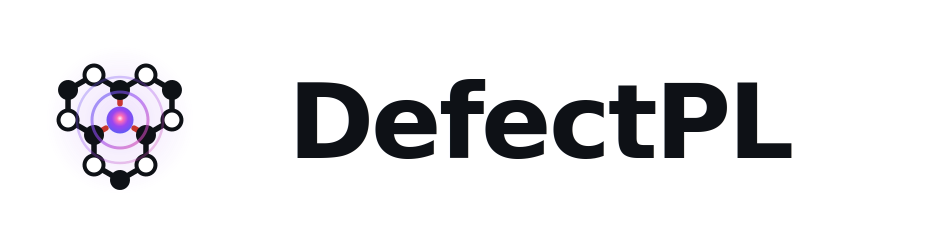
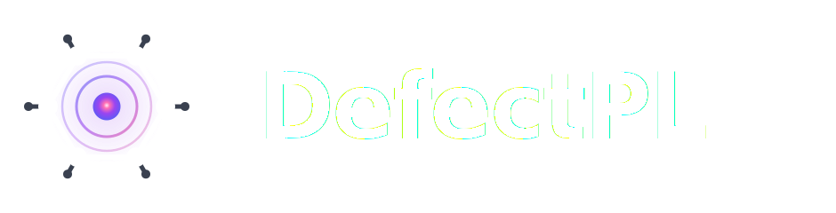

---
hide:
  - navigation
  - toc
---

<div style="text-align:center; padding: 2.5rem 0 0.5rem;">
  
  

  <p style="font-size:1.1rem; opacity:0.8; max-width:620px; margin:0.8rem auto 1.4rem;">
    First-principles photoluminescence lineshapes, electron–phonon coupling, and<br>
    electronic-state localization for point defects in semiconductors and insulators.
  </p>

  <div class="badge-row">
    <a href="https://pypi.org/project/defectpl"></a>
    <a href="https://anaconda.org/conda-forge/defectpl"></a>
    <a href="https://pepy.tech/project/defectpl"></a>
    <a href="https://opensource.org/licenses/MIT"></a>
    
  </div>

  <div style="display:flex; gap:0.8rem; justify-content:center; flex-wrap:wrap; margin-bottom:2.5rem;">
    <a href="getting_started/" class="md-button md-button--primary">Get started</a>
    <a href="api/" class="md-button">API reference</a>
    <a href="https://github.com/Shibu778/defectpl" class="md-button">GitHub</a>
  </div>
</div>

---

## Capabilities

<div class="feature-grid">
  <div class="feature-card">
    <h3>🌈 PL Lineshapes</h3>
    <p>Multi-phonon photoluminescence spectra via the generating-function approach
    (Alkauskas <em>et al.</em> 2014).</p>
  </div>
  <div class="feature-card">
    <h3>📊 Huang–Rhys Factors</h3>
    <p>Mode-resolved partial HR factors S<sub>k</sub> and the continuous spectral
    density S(ω) from displacement or vertical-force data.</p>
  </div>
  <div class="feature-card">
    <h3>🔬 Electronic Localization</h3>
    <p>P-ratio and IPR from VASP PROCAR — identify defect-character Kohn–Sham
    states without pydefect.</p>
  </div>
  <div class="feature-card">
    <h3>⚛️ Phonon Analysis</h3>
    <p>Phonon IPR, localization ratio, and phonopy integration for force-constant
    extraction and Γ-point band structures.</p>
  </div>
  <div class="feature-card">
    <h3>📐 Configuration Coordinate</h3>
    <p>ΔQ, ΔR, parabolic PES fitting, Stokes shift, and vertical transition
    energies from interpolated supercell calculations.</p>
  </div>
  <div class="feature-card">
    <h3>🖼️ Publication Plots</h3>
    <p>Ten standard diagnostic plots — intensity, S(ω), IPR, HR scatter — plus
    KS level diagrams coloured by P-ratio.</p>
  </div>
</div>

---

## Quick install

=== "Full (VASP + phonopy)"
    ```bash
    pip install "defectpl[all]"
    ```

=== "Core only"
    ```bash
    pip install defectpl
    ```

=== "conda-forge"
    ```bash
    conda install -c conda-forge defectpl
    ```

---

## Five-minute example

```python
from pymatgen.core import Structure
from defectpl.phonon import read_band_yaml
from defectpl.vasp_wrapper import calc_dR
from defectpl.defectpl import Photoluminescence

gs = Structure.from_file("CONTCAR_gs")
es = Structure.from_file("CONTCAR_es")
frequencies, eigenvectors, masses = read_band_yaml("band.yaml")

pl = Photoluminescence(
    frequencies=frequencies,
    eigenvectors=eigenvectors,
    masses=masses,
    EZPL=1.945,        # Zero-phonon line energy in eV
    dR=calc_dR(gs, es),
    gamma=2.0,         # ZPL broadening in meV
)

print(f"Huang–Rhys factor  S = {pl.HR_factor:.3f}")
print(f"Debye–Waller factor  = {pl.DW_factor:.4f}")

pl.generate_plots(out_dir="./plots/", fig_format="png")
```

---

## Cite

If you use DefectPL in published work, please cite:

> Shibu Meher *et al.*, **Carbon with Stone-Wales Defect as Quantum Emitter in h-BN**,
> *Phys. Rev. B* **111**, 104109 (2025). [doi:10.1103/PhysRevB.111.104109](https://doi.org/10.1103/PhysRevB.111.104109)

> Shibu Meher *et al.*, **High-throughput Computational Search for Group-IV-related Quantum
> Defects as Spin-photon Interfaces in 4H-SiC**, *Phys. Rev. B* **112**, 184112 (2025).
> [doi:10.1103/PhysRevB.112.184112](https://doi.org/10.1103/PhysRevB.112.184112)

---

## Acknowledgements

DefectPL implements the generating-function formalism of
Alkauskas, Buckley, Awschalom & Van de Walle (*New J. Phys.* **16**, 073026, 2014)
and the Franck–Condon overlap approach of Alkauskas, Yan & Van de Walle
(*Phys. Rev. B* **90**, 075202, 2014).
Electronic P-ratio follows Kumagai *et al.* (*Phys. Rev. B* **103**, 104102, 2021).
