# NV Diamond Plot Summary

This file provides an organized overview of all generated high-throughput framework plots across different functionals and calculation modes.

---

## Functional: frac_hse06_out

### Mode: abs_gs_force_mode

> **Important Properties Info:**
>
> ===================================================
>                 PROPERTIES SUMMARY                 
> ===================================================
> Calculation Run Mode         :   Force Mode
> Zero-Phonon Line (ZPL) Energy :         2.19 eV
> Total Huang-Rhys (HR) Factor :     4.485894
> Debye-Waller (DW) Factor     :     0.011267
> ---------------------------------------------------
> Total Number of Atoms (natoms):          215
> ZPL Broadening Factor (gamma) :         2.00 meV
> Gaussian Broadening (sigma)   :     0.006000 eV
> Energy Mesh Resolution        :         1000 points/eV
> ===================================================

| Plot Name | Visualization |
| :--- | :--- |
| HR factor vs penergy | 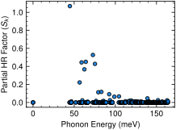 |
| S omega HRf ipr vs penergy | 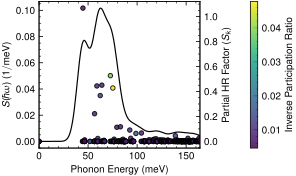 |
| S omega HRf loc rat vs penergy | 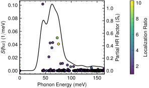 |
| S omega Sks vs penergy |  |
| S omega vs penergy | 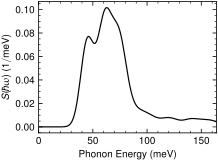 |
| intensity vs penergy | 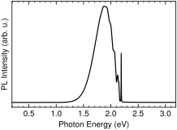 |
| ipr vs penergy | 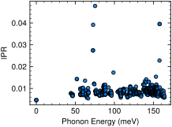 |
| loc rat vs penergy | 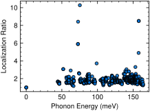 |
| penergy vs pmode |  |
| qk vs penergy | 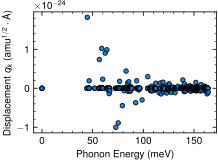 |

---
### Mode: gs_zpl_disp_mode

> **Important Properties Info:**
>
> ===================================================
>                 PROPERTIES SUMMARY                 
> ===================================================
> Calculation Run Mode         : Displacement Mode
> Zero-Phonon Line (ZPL) Energy :         2.19 eV
> Total Huang-Rhys (HR) Factor :     3.203480
> Debye-Waller (DW) Factor     :     0.040621
> Mass-Weighted Delta Q (delQ)  :     0.667367 amu^(1/2)*Ã…
> Structural Delta R (delR)     :     0.190678 Ã…
> ---------------------------------------------------
> Total Number of Atoms (natoms):          215
> ZPL Broadening Factor (gamma) :         2.00 meV
> Gaussian Broadening (sigma)   :     0.006000 eV
> Energy Mesh Resolution        :         1000 points/eV
> ===================================================

| Plot Name | Visualization |
| :--- | :--- |
| HR factor vs penergy | 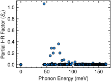 |
| S omega HRf ipr vs penergy | 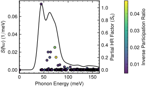 |
| S omega HRf loc rat vs penergy | 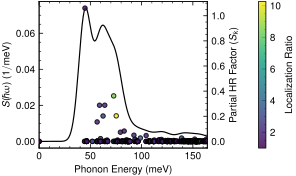 |
| S omega Sks vs penergy | 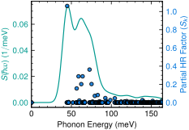 |
| S omega vs penergy | 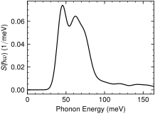 |
| intensity vs penergy |  |
| ipr vs penergy |  |
| loc rat vs penergy |  |
| penergy vs pmode |  |
| qk vs penergy | 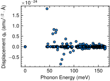 |

---
### Mode: zpl_ems_force_mode

> **Important Properties Info:**
>
> ===================================================
>                 PROPERTIES SUMMARY                 
> ===================================================
> Calculation Run Mode         :   Force Mode
> Zero-Phonon Line (ZPL) Energy :         2.19 eV
> Total Huang-Rhys (HR) Factor :     3.229683
> Debye-Waller (DW) Factor     :     0.039570
> ---------------------------------------------------
> Total Number of Atoms (natoms):          215
> ZPL Broadening Factor (gamma) :         2.00 meV
> Gaussian Broadening (sigma)   :     0.006000 eV
> Energy Mesh Resolution        :         1000 points/eV
> ===================================================

| Plot Name | Visualization |
| :--- | :--- |
| HR factor vs penergy | 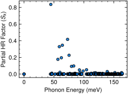 |
| S omega HRf ipr vs penergy | 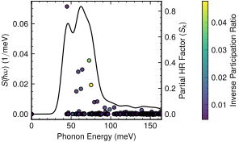 |
| S omega HRf loc rat vs penergy | 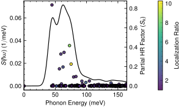 |
| S omega Sks vs penergy |  |
| S omega vs penergy | 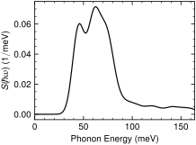 |
| intensity vs penergy | 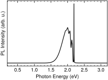 |
| ipr vs penergy |  |
| loc rat vs penergy |  |
| penergy vs pmode |  |
| qk vs penergy | 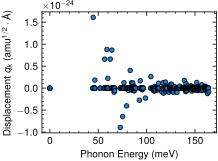 |

---

## Functional: frac_pbe_out

### Mode: abs_gs_force_mode

> **Important Properties Info:**
>
> ===================================================
>                 PROPERTIES SUMMARY                 
> ===================================================
> Calculation Run Mode         :   Force Mode
> Zero-Phonon Line (ZPL) Energy :        1.729 eV
> Total Huang-Rhys (HR) Factor :     3.186198
> Debye-Waller (DW) Factor     :     0.041329
> ---------------------------------------------------
> Total Number of Atoms (natoms):          215
> ZPL Broadening Factor (gamma) :         2.00 meV
> Gaussian Broadening (sigma)   :     0.006000 eV
> Energy Mesh Resolution        :         1000 points/eV
> ===================================================

| Plot Name | Visualization |
| :--- | :--- |
| HR factor vs penergy | 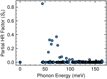 |
| S omega HRf ipr vs penergy | 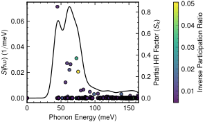 |
| S omega HRf loc rat vs penergy | 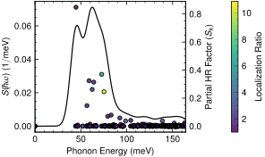 |
| S omega Sks vs penergy | 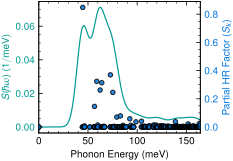 |
| S omega vs penergy | 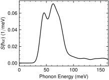 |
| intensity vs penergy | 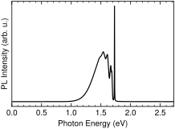 |
| ipr vs penergy | 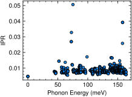 |
| loc rat vs penergy | 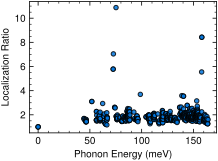 |
| penergy vs pmode | 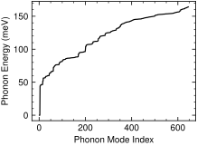 |
| qk vs penergy | 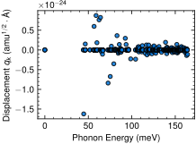 |

---
### Mode: gs_zpl_disp_mode

> **Important Properties Info:**
>
> ===================================================
>                 PROPERTIES SUMMARY                 
> ===================================================
> Calculation Run Mode         : Displacement Mode
> Zero-Phonon Line (ZPL) Energy :        1.729 eV
> Total Huang-Rhys (HR) Factor :     2.574647
> Debye-Waller (DW) Factor     :     0.076181
> Mass-Weighted Delta Q (delQ)  :     0.603373 amu^(1/2)*Ã…
> Structural Delta R (delR)     :     0.172432 Ã…
> ---------------------------------------------------
> Total Number of Atoms (natoms):          215
> ZPL Broadening Factor (gamma) :         2.00 meV
> Gaussian Broadening (sigma)   :     0.006000 eV
> Energy Mesh Resolution        :         1000 points/eV
> ===================================================

| Plot Name | Visualization |
| :--- | :--- |
| HR factor vs penergy | 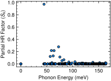 |
| S omega HRf ipr vs penergy |  |
| S omega HRf loc rat vs penergy | 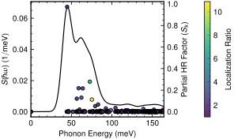 |
| S omega Sks vs penergy | 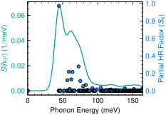 |
| S omega vs penergy | 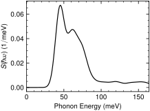 |
| intensity vs penergy | 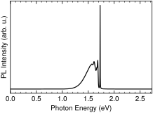 |
| ipr vs penergy |  |
| loc rat vs penergy |  |
| penergy vs pmode |  |
| qk vs penergy | 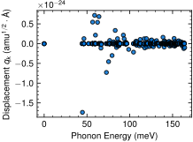 |

---
### Mode: zpl_ems_force_mode

> **Important Properties Info:**
>
> ===================================================
>                 PROPERTIES SUMMARY                 
> ===================================================
> Calculation Run Mode         :   Force Mode
> Zero-Phonon Line (ZPL) Energy :        1.729 eV
> Total Huang-Rhys (HR) Factor :     2.417947
> Debye-Waller (DW) Factor     :     0.089104
> ---------------------------------------------------
> Total Number of Atoms (natoms):          215
> ZPL Broadening Factor (gamma) :         2.00 meV
> Gaussian Broadening (sigma)   :     0.006000 eV
> Energy Mesh Resolution        :         1000 points/eV
> ===================================================

| Plot Name | Visualization |
| :--- | :--- |
| HR factor vs penergy | 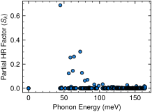 |
| S omega HRf ipr vs penergy | 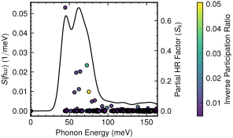 |
| S omega HRf loc rat vs penergy | 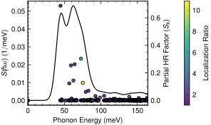 |
| S omega Sks vs penergy | 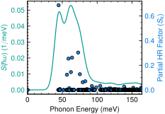 |
| S omega vs penergy | 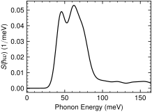 |
| intensity vs penergy | 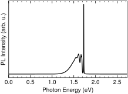 |
| ipr vs penergy |  |
| loc rat vs penergy |  |
| penergy vs pmode |  |
| qk vs penergy | 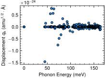 |

---

## Functional: hse06_out

### Mode: abs_gs_force_mode

> **Important Properties Info:**
>
> ===================================================
>                 PROPERTIES SUMMARY                 
> ===================================================
> Calculation Run Mode         :   Force Mode
> Zero-Phonon Line (ZPL) Energy :        1.991 eV
> Total Huang-Rhys (HR) Factor :     5.029075
> Debye-Waller (DW) Factor     :     0.006545
> ---------------------------------------------------
> Total Number of Atoms (natoms):          215
> ZPL Broadening Factor (gamma) :         2.00 meV
> Gaussian Broadening (sigma)   :     0.006000 eV
> Energy Mesh Resolution        :         1000 points/eV
> ===================================================

| Plot Name | Visualization |
| :--- | :--- |
| HR factor vs penergy | 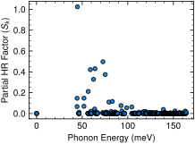 |
| S omega HRf ipr vs penergy | 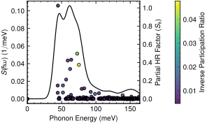 |
| S omega HRf loc rat vs penergy | 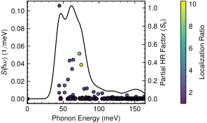 |
| S omega Sks vs penergy | 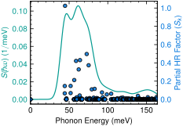 |
| S omega vs penergy | 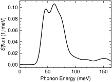 |
| intensity vs penergy | 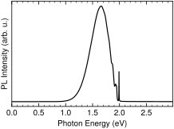 |
| ipr vs penergy | 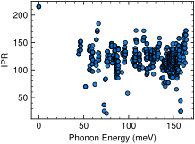 |
| loc rat vs penergy |  |
| penergy vs pmode |  |
| qk vs penergy |  |

---
### Mode: gs_zpl_disp_mode

> **Important Properties Info:**
>
> ===================================================
>                 PROPERTIES SUMMARY                 
> ===================================================
> Calculation Run Mode         : Displacement Mode
> Zero-Phonon Line (ZPL) Energy :        1.991 eV
> Total Huang-Rhys (HR) Factor :     3.231119
> Debye-Waller (DW) Factor     :     0.039513
> Mass-Weighted Delta Q (delQ)  :     0.667635 amu^(1/2)*Ã…
> Structural Delta R (delR)     :     0.190834 Ã…
> ---------------------------------------------------
> Total Number of Atoms (natoms):          215
> ZPL Broadening Factor (gamma) :         2.00 meV
> Gaussian Broadening (sigma)   :     0.006000 eV
> Energy Mesh Resolution        :         1000 points/eV
> ===================================================

| Plot Name | Visualization |
| :--- | :--- |
| HR factor vs penergy |  |
| S omega HRf ipr vs penergy |  |
| S omega HRf loc rat vs penergy |  |
| S omega Sks vs penergy |  |
| S omega vs penergy |  |
| intensity vs penergy |  |
| ipr vs penergy |  |
| loc rat vs penergy |  |
| penergy vs pmode |  |
| qk vs penergy |  |

---
### Mode: zpl_ems_force_mode

> **Important Properties Info:**
>
> ===================================================
>                 PROPERTIES SUMMARY                 
> ===================================================
> Calculation Run Mode         :   Force Mode
> Zero-Phonon Line (ZPL) Energy :        1.991 eV
> Total Huang-Rhys (HR) Factor :     3.439309
> Debye-Waller (DW) Factor     :     0.032087
> ---------------------------------------------------
> Total Number of Atoms (natoms):          215
> ZPL Broadening Factor (gamma) :         2.00 meV
> Gaussian Broadening (sigma)   :     0.006000 eV
> Energy Mesh Resolution        :         1000 points/eV
> ===================================================

| Plot Name | Visualization |
| :--- | :--- |
| HR factor vs penergy |  |
| S omega HRf ipr vs penergy |  |
| S omega HRf loc rat vs penergy |  |
| S omega Sks vs penergy |  |
| S omega vs penergy |  |
| intensity vs penergy |  |
| ipr vs penergy |  |
| loc rat vs penergy |  |
| penergy vs pmode |  |
| qk vs penergy |  |

---

## Functional: pbe_out

### Mode: abs_gs_force_mode

> **Important Properties Info:**
>
> ===================================================
>                 PROPERTIES SUMMARY                 
> ===================================================
> Calculation Run Mode         :   Force Mode
> Zero-Phonon Line (ZPL) Energy :         1.75 eV
> Total Huang-Rhys (HR) Factor :     3.872026
> Debye-Waller (DW) Factor     :     0.020816
> ---------------------------------------------------
> Total Number of Atoms (natoms):          215
> ZPL Broadening Factor (gamma) :         2.00 meV
> Gaussian Broadening (sigma)   :     0.006000 eV
> Energy Mesh Resolution        :         1000 points/eV
> ===================================================

| Plot Name | Visualization |
| :--- | :--- |
| HR factor vs penergy |  |
| S omega HRf ipr vs penergy |  |
| S omega HRf loc rat vs penergy |  |
| S omega Sks vs penergy |  |
| S omega vs penergy |  |
| intensity vs penergy |  |
| ipr vs penergy |  |
| loc rat vs penergy |  |
| penergy vs pmode |  |
| qk vs penergy |  |

---
### Mode: gs_zpl_disp_mode

> **Important Properties Info:**
>
> ===================================================
>                 PROPERTIES SUMMARY                 
> ===================================================
> Calculation Run Mode         : Displacement Mode
> Zero-Phonon Line (ZPL) Energy :         1.75 eV
> Total Huang-Rhys (HR) Factor :     2.927105
> Debye-Waller (DW) Factor     :     0.053552
> Mass-Weighted Delta Q (delQ)  :     0.642559 amu^(1/2)*Ã…
> Structural Delta R (delR)     :     0.183851 Ã…
> ---------------------------------------------------
> Total Number of Atoms (natoms):          215
> ZPL Broadening Factor (gamma) :         2.00 meV
> Gaussian Broadening (sigma)   :     0.006000 eV
> Energy Mesh Resolution        :         1000 points/eV
> ===================================================

| Plot Name | Visualization |
| :--- | :--- |
| HR factor vs penergy |  |
| S omega HRf ipr vs penergy |  |
| S omega HRf loc rat vs penergy |  |
| S omega Sks vs penergy |  |
| S omega vs penergy |  |
| intensity vs penergy |  |
| ipr vs penergy |  |
| loc rat vs penergy |  |
| penergy vs pmode |  |
| qk vs penergy |  |

---
### Mode: zpl_ems_force_mode

> **Important Properties Info:**
>
> ===================================================
>                 PROPERTIES SUMMARY                 
> ===================================================
> Calculation Run Mode         :   Force Mode
> Zero-Phonon Line (ZPL) Energy :         1.75 eV
> Total Huang-Rhys (HR) Factor :     2.731487
> Debye-Waller (DW) Factor     :     0.065122
> ---------------------------------------------------
> Total Number of Atoms (natoms):          215
> ZPL Broadening Factor (gamma) :         2.00 meV
> Gaussian Broadening (sigma)   :     0.006000 eV
> Energy Mesh Resolution        :         1000 points/eV
> ===================================================

| Plot Name | Visualization |
| :--- | :--- |
| HR factor vs penergy |  |
| S omega HRf ipr vs penergy |  |
| S omega HRf loc rat vs penergy |  |
| S omega Sks vs penergy |  |
| S omega vs penergy |  |
| intensity vs penergy |  |
| ipr vs penergy |  |
| loc rat vs penergy |  |
| penergy vs pmode |  |
| qk vs penergy |  |

---